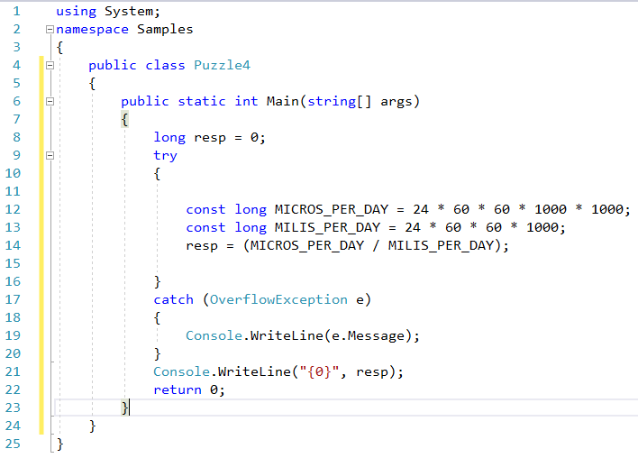
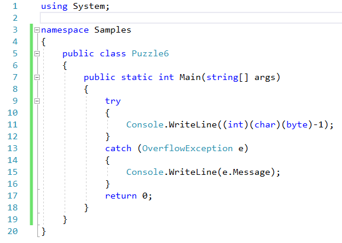
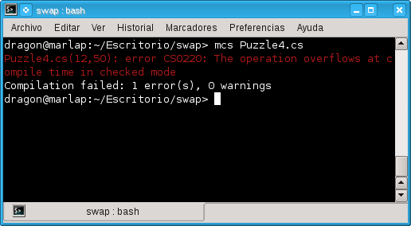
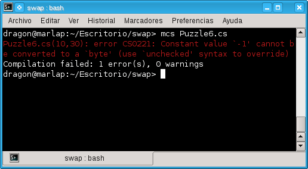
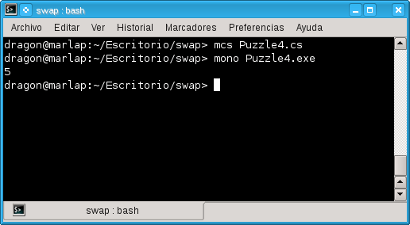
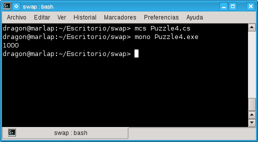

# Uso de unchecked en C#

Mencione sobre algunos ejemplos que tome del libro <b>Java Puzzlers: Traps, Pitfalls, and Corner Cases</b> de <i>Joshua Bloch</i> y <i>Neal Gafter</i> publicado por Addison Wesley Professional en el año 2005 donde vienen curiosidades y trucos acerca de la programación con Java, Los siguientes ejemplos se encuentran en el libro y requieren el uso en C# de los operadores checked y unchecked para controlar la comprobación de overflow en operaciones aritméticas y conversiones.

Siempre que trabajemos con operaciones numéricas o con conversiones en nuestros programas hay posibilidades de que suceda un overflow (desbordamiento) cuando el resultado de dicha operación sobrepase la capacidad mínima o máxima de la variable que usemos para contener ese resultado. Los siguientes listados ejemplifican el uso de estos operadores.

<b>Fig 1. El primer ejemplo sin la palabra unchecked.</b>

<b>Fig 2. El segundo ejemplo sin la palabra unchecked.</b>

En el primer caso el compilador envía el siguiente error:

<pre>
Puzzle4.cs(12,50): error CS0220: The operation overflows at compile time in checked mode
</pre>

Para el segundo caso el mensaje es similar

<pre>
Puzzle6.cs(10,30): error CS0221: Constant value `-1' cannot be converted to a `byte' (use `unchecked' syntax to override) Compilation failed: 1 error(s), 0 warnings
</pre>

Debido a que en los dos listados el overflow puede ser comprobado en tiempo de compilación, en C# de forma predeterminada todo el código asignado a constantes es comprobado aunque este dentro de un bloque unchecked, y para las variables si el overflow ocurre en tiempo de ejecución el programa lanza una OverflowException excepto que sea suprimida usando unchecked.

Por lo tanto para compilar los listados, debemos de usar un bloque unchecked en la asignación de las siguientes variables en el primer listado:

<pre>
unchecked{
 const long MICROS_PER_DAY = 24 * 60 * 60 * 1000 * 1000;
 const long MILIS_PER_DAY = 24 * 60 * 60 * 1000;   
 resp = (MICROS_PER_DAY / MILIS_PER_DAY);   
     }
</pre>

Y un bloque similar en el segundo listado.

<pre>
unchecked
        {
Console.WriteLine((int)(char)(byte)-1);
    }
</pre>

El uso de unchecked en el primer listado ocasiona que no se produzca una excepción aunque ocurra el overflow esto siempre ocasiona que los valores sean truncados, por lo que el resultado de la ejecucción de este programa no es lo esperado.

Para solucionar por completo el código del listado 1 debemos agregar el caracter L al final del primer término (en este ejemplo el número 24), así toda las subsecuentes expresiones seran de tipo long.
El bloque de código se muestra a continuación.

<pre>
const long MICROS_PER_DAY = 24L * 60 * 60 * 1000 * 1000;
 const long MILIS_PER_DAY = 24L * 60 * 60 * 1000;   
 resp = (MICROS_PER_DAY / MILIS_PER_DAY);  
</pre>
La salida al ejecutar el listado 1 es

y la salida al ejecutar el listado 2 es

